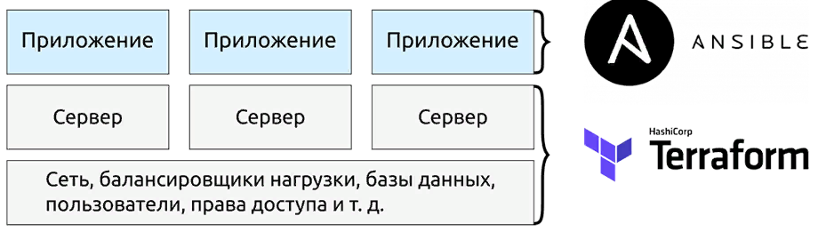
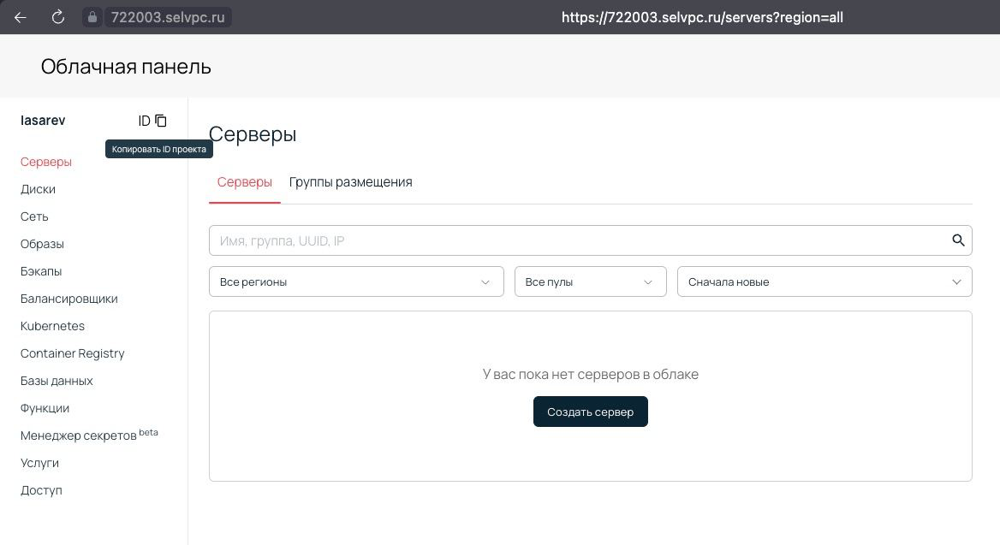

# CloudPractice
Практическое задание для студентов SPBSTU. Работа с terraform и облаком selectel

В данной практике необходимо создать инфраструктуру в проекте Selectel с помощью terraform и сконфигурировать веб-сервисы с помощью ansible


В качестве конечного приложения можно выбрать либо https://github.com/antonaleks/DockerPractice либо контейнер с todo и БД из https://www.docker.com/101-tutorial/
В первом случаем необходимо создать n=3 виртуальные машины в том же принципе (две разные подсети, одна виртуальная машина как шлюз)
Во втором случае проще - нужно создать n=2 виртуальные машины, одну для todo app, другую для mysql DB
## Terraform
1. В провайдере openstack заполнить своими данными поля из excel таблицы
- domain_name = <domain из экселя>
- tenant_id   = <id проекта, см скриншот в источниках>
- user_name   = <логин из экселя>
- password    = "пароль из экселя"
- region      = "ru-3"
2. Необходимо развернуть n количество ВМ с атрибутом прерываемый
2. Развернуть необходимые подсети
3. Создать публичный ssh ключ и приатачить к ВМ
4. Создать загружаемый диск с ubuntu 20.04
5. Создать flavor 1CPU 2 gb RAM, Диск объем 10гб на каждую вм (базовый hdd)
6. Для каждой ВМ зафиксировать публичный ip адрес
7. В output зафиксировать вывод ip адрес и команду ssh для полключения
8. Создать файл inventory.ini для ansible, где описаны айпи адреса созданных ВМ

В качестве примеров использовать [vpc-example](vpc-example), заменив на прерываемую ВМ либо [preempible_sever](preemptible_server) с модулями

## Ansible
1. Использовать сгенерированный terraform'ом inventory файл
2. Написать плейбуки для развертывания ваших приложений в docker-compose файлах. [Пример](https://github.com/antonaleks/ya-praktikum-infra/tree/main/ansible)

## Итог
В итоге по запуску команд
```bash
terraform apply
```
должна сгенерироваться инфраструктура и inventory.ini

по запуску команд
```bash
ansible-playbook your-playbook.yml
```
должно установиться ваше приложение на инфрастуктуру автоматически. Критерием выполнения задания является доступность веб интерфейса в публичном ip адресе (grafana в 1 случае и todo-app во втором)

## Раздел по безопасности
Ни в коем случае нельзя хранить в репозитории чувствительные данные! Работа не принимается, если в репозитории будут лежать логины, пароли от ВМ!

# Источники
- ресурсы опенстека в [terraform registry](https://terraform-eap.website.yandexcloud.net/docs/providers/openstack/index.html)
- откуда брать id проекта

- установка terraform через зеркало [яндекса](https://cloud.yandex.ru/docs/tutorials/infrastructure-management/terraform-quickstart)
- документация [selectel](https://docs.selectel.ru/cloud/servers/tools/terraform/)
- [примеры selectel](https://github.com/selectel/terraform-examples) (terraform selectel provider использовать не нужно, только openstack)
- пример связки [terraform+ansible](https://github.com/antonaleks/ya-praktikum-infra). смотреть папку [terraform](https://github.com/antonaleks/ya-praktikum-infra/blob/main/terraform/sausage-store/main.tf) и [ansible](https://github.com/antonaleks/ya-praktikum-infra/tree/main/ansible)