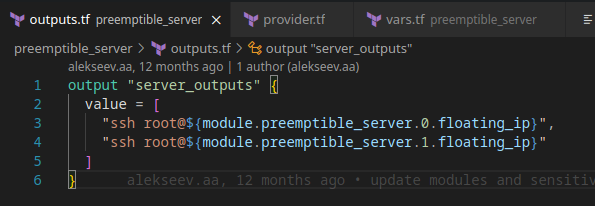

# Отчет

Задание - развернуть две виртуальные машины с помощью Terraform. С помощью Ansible на одной запустить докер образ приложения todo-list из туториала к докеру, на второй запустить базу данных для этого приложения.

## Использование

```bash
cd preemptible_server
terraform init
terraform apply
cd ../ansible
ansible-playbook playbook.yml
```

## Скриншоты
 - openstack provider

 

 - servers
 


 - networks


 

 

 - Задание ключа для доступа к ВМ


 - Create flavor 1CPU 1 gb RAM, Disk 5gb per vm (basic hdd) 


 - the output

 

- `inventory.tmpl`


after running terraform apply:


 - an inventory.ini file for ansible, which describes the IP addresses of the created VMs 
 
 

 - playbooks for deploying the application in docker-compose files
 
 


## Результат

При переходе по адресу `http://5.188.81.9/` мы попадаем на страницу с приложением todo-list

