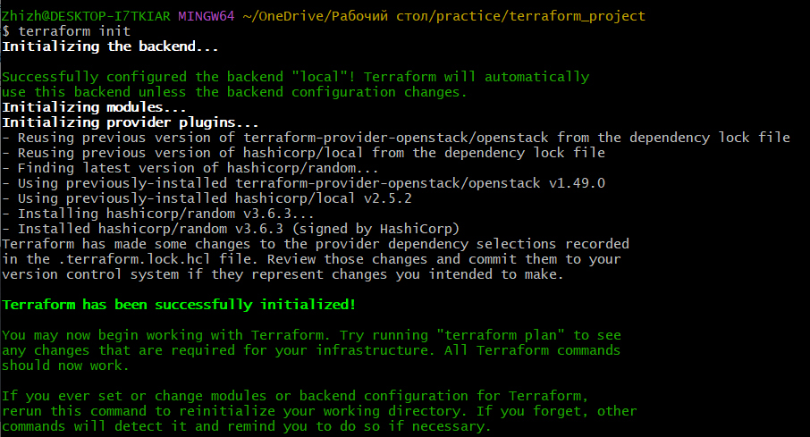
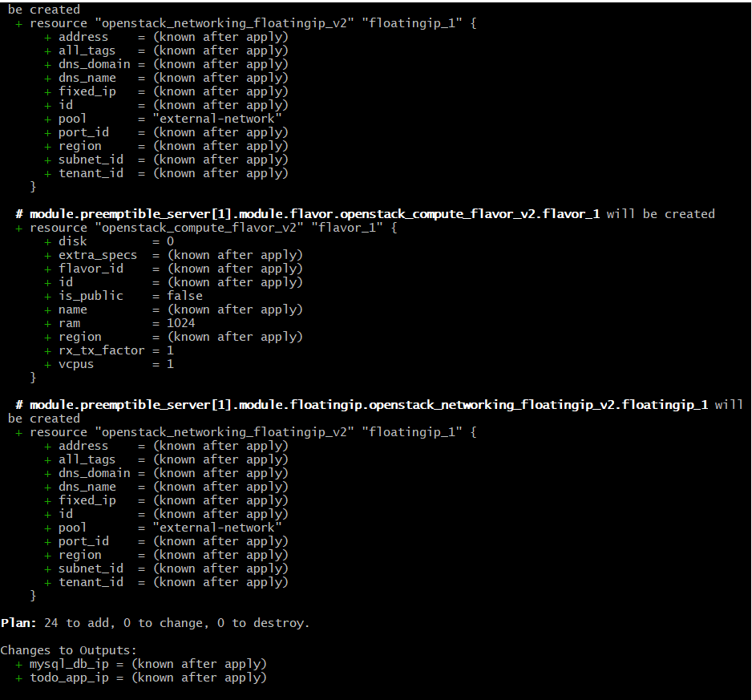
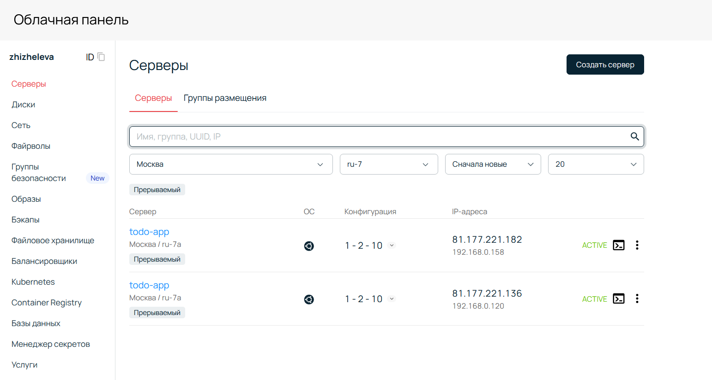
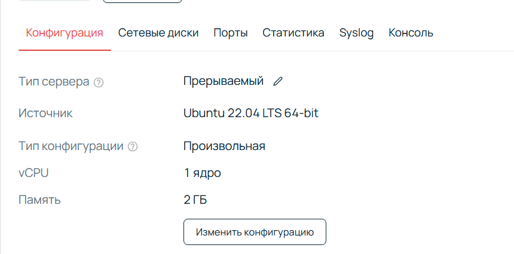
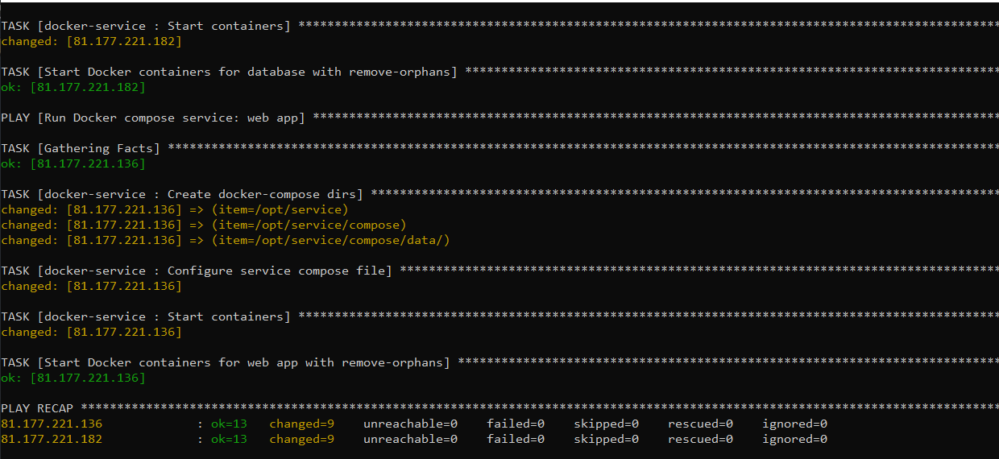
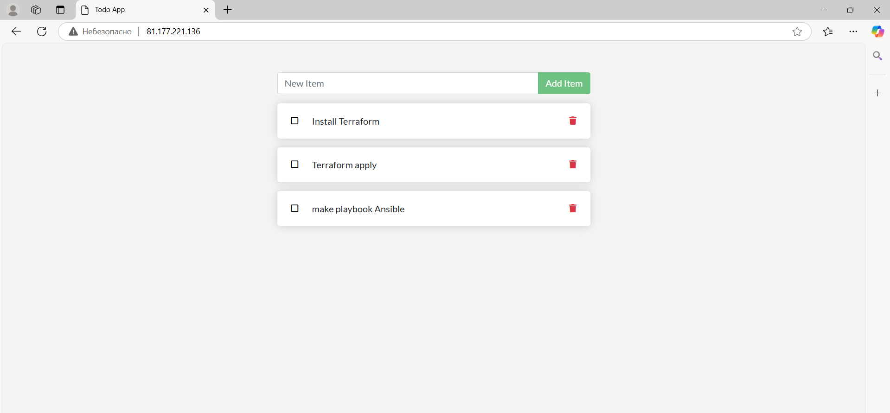

# Жижилева Арина. Практическое задание работа с terraform и облаком selectel.

В данной практике необходимо создать инфраструктуру в проекте Selectel с помощью terraform и сконфигурировать веб-сервисы с помощью ansible 
Нужно создать n=2 виртуальные машины, одну для todo app, другую для mysql DB.

1. Необходимо развернуть n количество ВМ с атрибутом прерываемый
2. Развернуть необходимые подсети
3. Создать публичный ssh ключ и приатачить к ВМ
4. Создать загружаемый диск с ubuntu 22.04
5. Создать flavor 1CPU 2 gb RAM, Диск объем 10гб на каждую вм (базовый hdd)
6. Для каждой ВМ зафиксировать публичный ip адрес
7. В output зафиксировать вывод ip адрес и команду ssh для полключения
8. Создать файл inventory.ini для ansible, где описаны айпи адреса созданных ВМ

## Terraform

Создала файл main.tf с подключением к openstack, созданием ssh ключей, подключением сетей и созданием серверов. В этом файле также задаются публичные ip-адреса для машин и создается вывод информации о ресурсах. 

**код из файла main.tf:**
```json
provider "openstack" {
  auth_url    = "https://cloud.api.selcloud.ru/identity/v3"
  domain_name = var.domain_name
  tenant_id   = var.tenant_id
  user_name   = var.user_name
  password    = var.password
  region      = var.region
}

# 1. SSH-ключ
module "keypair" {
  source             = "./modules/keypair"
  keypair_name       = "tf_keypair"
  keypair_public_key = file("~/.ssh/id_rsa.pub")
  region             = var.region
}

# 2. Сеть и подсеть
module "nat" {
  source = "./modules/nat"
}

# 3. Серверы
module "preemptible_server" {
  count  = 2
  source = "./modules/server_remote_root_disk"

  server_name         = var.server_name
  server_zone         = var.server_zone
  server_vcpus        = var.server_vcpus
  server_ram_mb       = var.server_ram_mb
  server_root_disk_gb = var.server_root_disk_gb
  server_volume_type  = var.server_volume_type
  server_image_name   = var.server_image_name
  server_ssh_key      = module.keypair.keypair_name
  region              = var.region
  network_id          = module.nat.network_id
  subnet_id           = module.nat.subnet_id

  server_preemptible_tag = var.server_preemptible_tag
}


# 4. Публичные IP-адреса
resource "openstack_networking_floatingip_v2" "todo_fip" {
  pool = "external-network"
}

resource "openstack_networking_floatingip_v2" "mysql_fip" {
  pool = "external-network"
}

# Привязка IP к серверам
resource "openstack_compute_floatingip_associate_v2" "todo_fip_associate" {
  floating_ip = openstack_networking_floatingip_v2.todo_fip.address
  instance_id = module.preemptible_server[0].server_id
  depends_on  = [openstack_networking_floatingip_v2.todo_fip]  # Ensure floating IP is created before association
}

resource "openstack_compute_floatingip_associate_v2" "mysql_fip_associate" {
  floating_ip = openstack_networking_floatingip_v2.mysql_fip.address
  instance_id = module.preemptible_server[1].server_id
  depends_on  = [openstack_networking_floatingip_v2.mysql_fip]  # Ensure floating IP is created before association
}

# 5. Вывод информации о ресурсах
output "todo_app_ip" {
  value = openstack_networking_floatingip_v2.todo_fip.address
}

output "mysql_db_ip" {
  value = openstack_networking_floatingip_v2.mysql_fip.address
}

# Создание inventory файла для ansible
resource "local_file" "ansible_inventory" {
  content = templatefile("./resources/inventory.tmpl",
    {
      webapp_vm_ip_public  = module.preemptible_server.0.floating_ip,
      database_vm_ip_public      = module.preemptible_server.1.floating_ip,
      webapp_vm_ip_nat     = module.preemptible_server.1.nat_ip.0
    }
  )
  filename = "../ansible/inventory.ini"
}
```
Ни в коем случае нельзя хранить в репозитории чувствительные данные, поэтому они занесены в отдельный файл terraform.tfvars, который добавлен в gitignore.

**Применяю команду terraform init**


**Применяю команду terraform plan и затем terraform apply**


После этого развернулось 2 машины с атрибутом прерываемый и файл inventory.tmpl


Загружаемый диск с ubuntu 22.04, 1CPU 2 gb RAM, Диск объем 10гб на каждую вм



## Ansible

Запускаю playbook командой ansible-playbook -i inventory.ini playbook.yml



Теперь наше приложение доступно по публичному ip-адресу
