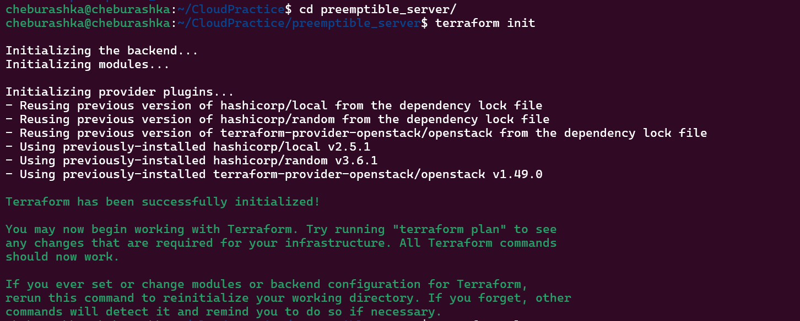
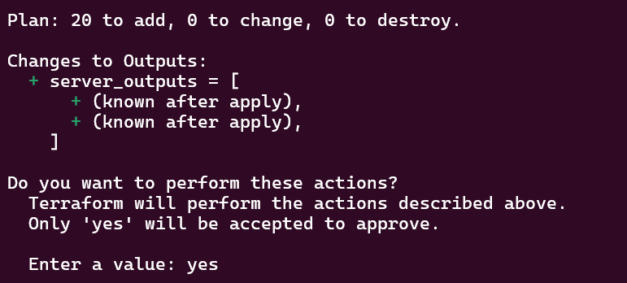
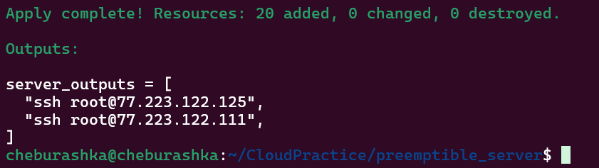
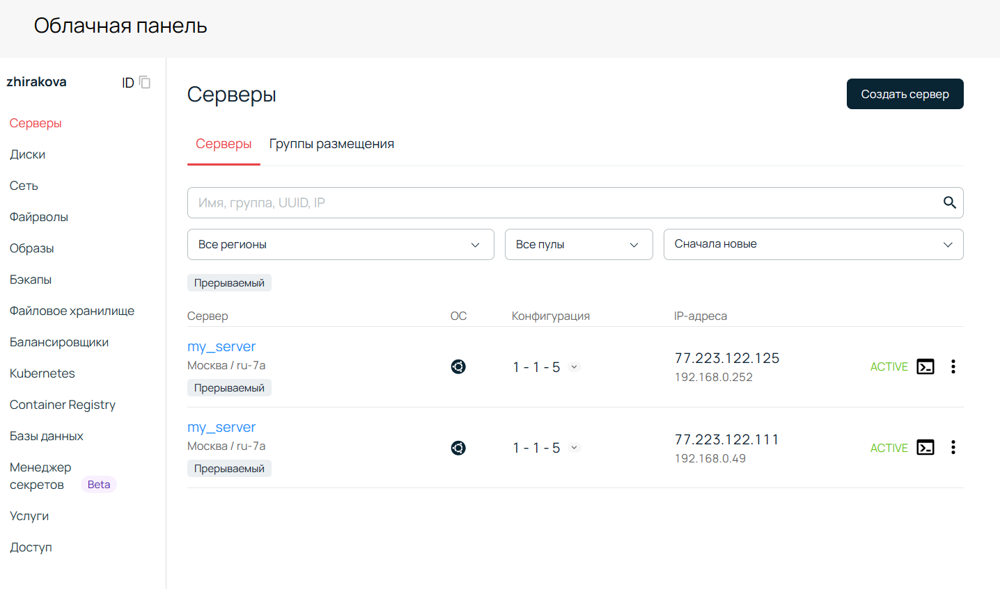
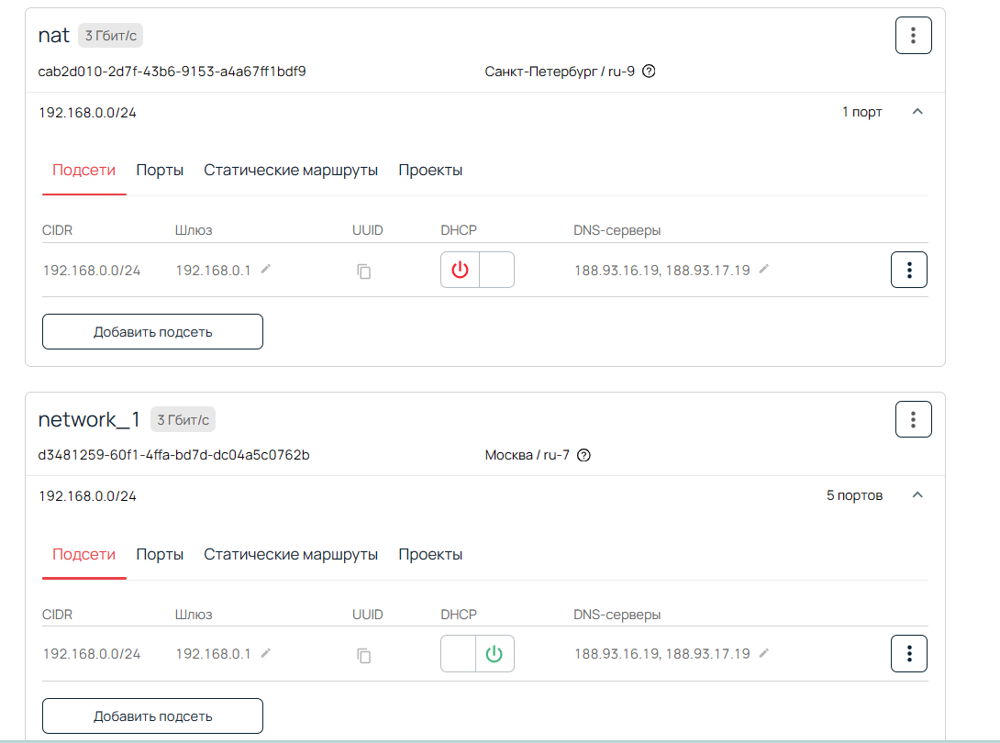
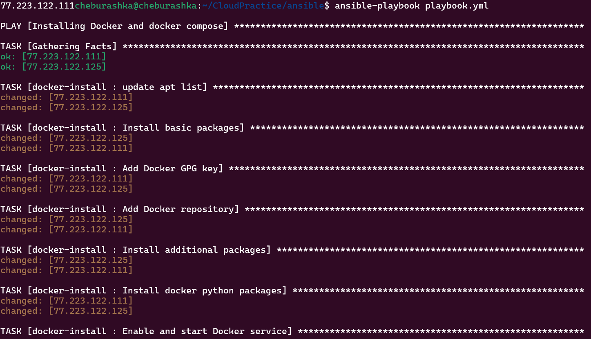
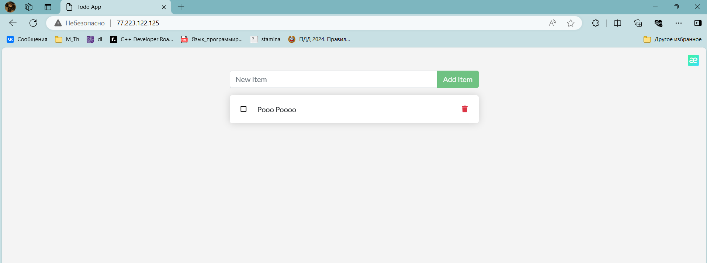

## Отчет по работе №3 "Infrastructure as Code" 

### Шаг 1 - создание инфраструктуры на серверах selectel используя *Terraform*

Файл main.tf выглядит следующим образом:
```
# Создание ключевой пары для доступа к ВМ
module "keypair" {
  source             = "./modules/keypair"
  keypair_name       = "keypair-tf"
  keypair_public_key = file("~/.ssh/id_rsa.pub")
  region             = var.region
}

# Создание приватной сети для ВМ
module "nat" {
  source = "./modules/nat"
}

# Создание прерываемого сервера.
module "preemptible_server" {
  count  = 2
  source = "./modules/server_remote_root_disk"

  server_name         = var.server_name
  server_zone         = var.server_zone
  server_vcpus        = var.server_vcpus
  server_ram_mb       = var.server_ram_mb
  server_root_disk_gb = var.server_root_disk_gb
  server_volume_type  = var.server_volume_type
  server_image_name   = var.server_image_name
  server_ssh_key      = module.keypair.keypair_name
  region              = var.region
  network_id          = module.nat.network_id
  subnet_id           = module.nat.subnet_id

  # Для смены прерываемого сервера на обычный используйте
  # переменную server_no_preemptible_tag:
  # server_preemptible_tag = var.server_no_preemptible_tag
  server_preemptible_tag = var.server_preemptible_tag
  #  server_ssh_key_user    = ""
}

# Создание inventory файла для ansible
resource "local_file" "ansible_inventory" {
  content = templatefile("./resources/inventory.tmpl",
    {
      webapp_vm_ip_public   = module.preemptible_server.0.floating_ip,
      database_vm_ip_public = module.preemptible_server.1.floating_ip,
      webapp_vm_ip_nat      = module.preemptible_server.1.nat_ip.0
    }
  )
  filename = "../ansible/inventory.ini"
}
```
Провайдер OpenStack:

```
# Инициализация провайдера OpenStack
provider "openstack" {
  auth_url    = "https://api.selvpc.ru/identity/v3"
  domain_name = var.domain_name
  tenant_id   = var.tenant_id
  user_name   = var.user_name
  password    = var.password
  region      = var.region
}
```
Где `domain_name`, `tenant_id`,`user_name`,`password`,`region` - чувствительные данные, хранящиеся в файле **terraform.tfvars**, игнорируемым git-ом.

Для конфигурации необходимо из папки проекта выполнить следующие команды:
1. `terraform init` - инициализация рабочего каталога (установка необходимых модулей)
1. `terraform plan` - шаг планирвания изменений
1. `terraform applay` - применение изменений


<p align="center">

terraforn init
</p>


<p align="center">

terraforn apply
</p>

После чего в терминале отобразятся (из конфигурации **output.tf**) добавленные ресурсы и данные для ssh подключений.

<p align="center">

outputs.tf
</p>


Содержимое файла **output.tf**:
```
output "server_outputs" {
  value = [
    "ssh root@${module.preemptible_server.0.floating_ip}",
    "ssh root@${module.preemptible_server.1.floating_ip}"
  ]
}
```

<p align="center">

Отображение созданных серверов через облачеую панель Selectel
</p>

<p align="center">

Приватные сети
</p>

Для взаимодействия terraform и ansible необходимо создать файл **inventoyry.tmpl** в папке `preemptible_server\resources`.
```tmpl
[webapp]
${webapp_vm_ip_public} private_database_ip=${webapp_vm_ip_nat}
[database]
${database_vm_ip_public}
```

После запуска terraform необходимо настроить ansible-playbook

1.docker-install для установки docker и docker-compose на всех хостах
1.docker-service для загрузки необходимых контейнеров и их запуска

Запуск плейбука производится через терминал из директории ansible командой:
`ansible-playbook playbook.yml`

После чего начнется запуск всех задач:


<p align="center">

Запуск плейбука
</p>

<p align="center">

Завершение выполнения плейбука
</p>


<p align="center">

Результат работы
</p>


