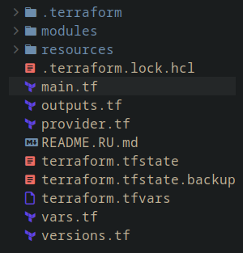
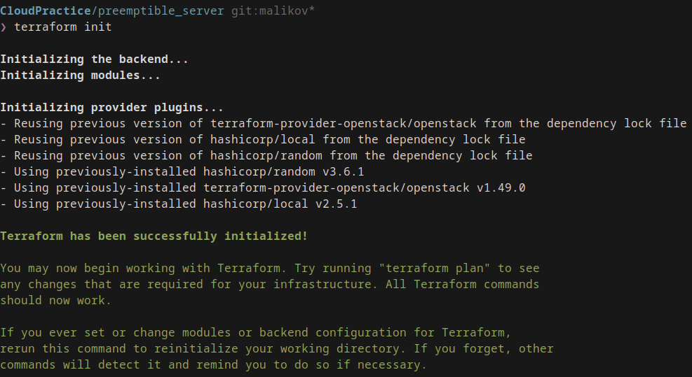
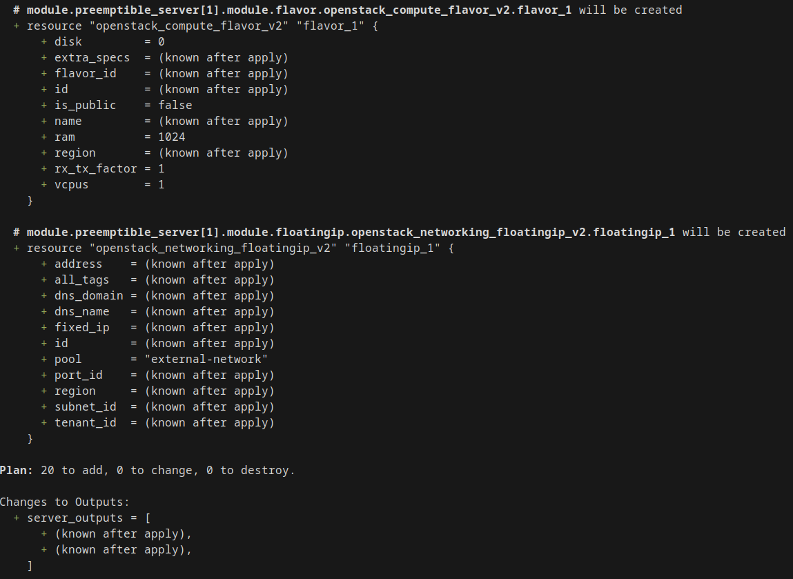
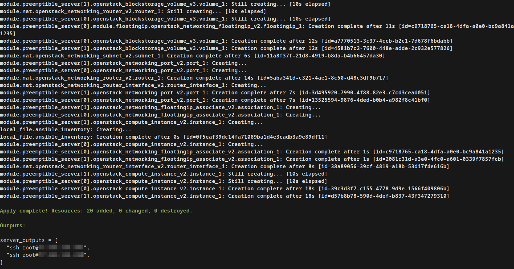
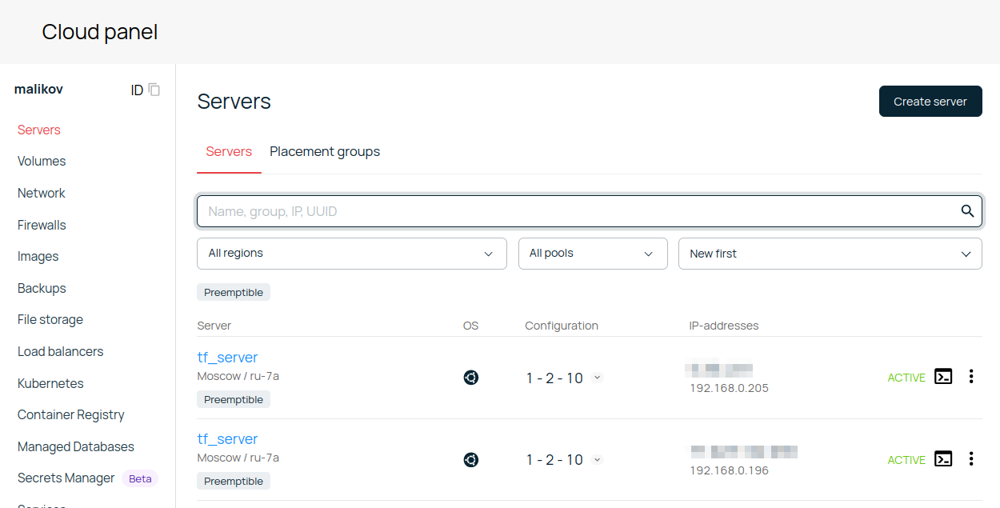
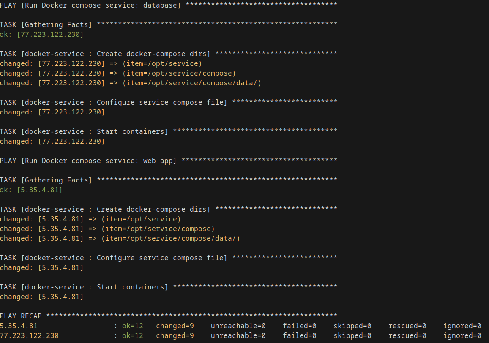
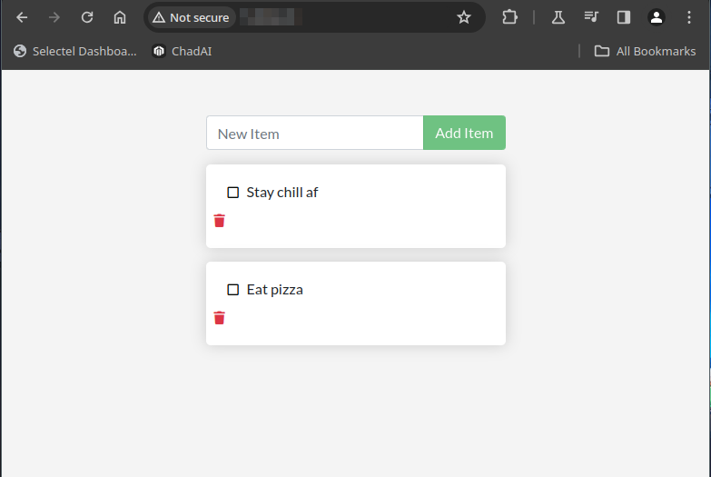

# Отчет
## IaC 

**Выполнил** Маликов Александр

**Группа** 5142704/30801 

## Постановка задачи
Необходимо создать (средствами terraform) и сконфигурировать (средствами ansible) серверы, работающие совместно. На серверах запустить веб-приложение "Todo list".

## Выполнение работы

### Terraform. Создание серверов

При создании серверов использовался проект terraform, структура которого показана на рисунке 1.

<p align="center">
 
Рисунок 1 - Структура проекта Terraform
</p>

Проект развертывает 2 прерываемых сервера и записывает их публичные ip адреса в файл `inventory.ini` в соответствии с шаблоном:

```ini
[webapp]
${webapp_vm_ip_public} private_database_ip=${webapp_vm_ip_nat}
[database]
${database_vm_ip_public}
```

Группа `webapp` - IP адрес фронтенда приложения, `database` - IP адрес сервера с базой данных.

В файле `terraform.tfvars` указаны данные учетной записи для доступа к облаку Selectel.

Запуск terraform осуществляется посредствам следующих команд:
```sh
terraform init
terraform plan
terrafrom apply
```

Результат запуска команд приведены ниже (см. рис. 2-4).


<p align="center">
 
Рисунок 2 - terraform init
</p>

<p align="center">
 
Рисунок 3 - terraform plan
</p>

<p align="center">
 
Рисунок 4 - terraform apply
</p>

Результатом запуска является 2 созданные машины (см. рис. 5), объединенные в общую сеть, а также файл `inventory.ini` с IP адресами серверов.

<p align="center">
 
Рисунок 5 - Сервера в среде Selectel
</p>

### Ansible. Конфигурация и запуск приложений

Посредствам ansible производилась настройка и запуск веб-приложений с использованием следующего playbook'а.

```yaml
- name: "Installing Docker and docker compose"
  hosts: all
  roles:
  - docker-install

- name: "Run Docker compose service: database"
  hosts: database
  vars_files:
    - "./docker-service/vars/database.yml"
  roles:
  - docker-service

- name: "Run Docker compose service: web app"
  hosts: webapp
  vars_files:
    - "./docker-service/vars/webapp.yml"
  roles:
  - docker-service
```

На машине группы `webapp` устанавливался `docker` и запускался контейнер с приложением "Todo list".

На машине группы `database` устанавливалась база данных `mysql`, на которой находились данные веб-приложения.

Работа с ansible производилась посредствам запуска команды `ansible-playbook playbook.yaml` (см. рис. 6).

<p align="center">
 
Рисунок 6 - Успешное завершение работы Ansible
</p>

## Результат

В результате по IP адресу машины с webapp можно зайти в веб-приложение (см. рис. 7).

<p align="center">
 
Рисунок 7 - Todo list
</p>

Список дел сохраняется также и после перезапуска страницы, благодаря mysql серверу.

## Всё

 